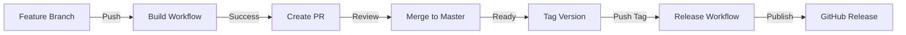

# Contributing to FFXI Manager

## 📋 Table of Contents
- [Development Workflow](#development-workflow)
- [Build and Release Process](#build-and-release-process)
- [Version Numbering](#version-numbering)
- [Branch Strategy](#branch-strategy)
- [Pull Request Process](#pull-request-process)
- [Release Process](#release-process)

---

## 🔄 Development Workflow

### Quick Start
```bash
# Clone the repository
git clone https://github.com/atperry7/ffxi-manager.git
cd ffxi-manager

# Create a feature branch
git checkout -b feature/your-feature-name

# Make changes and commit
git add .
git commit -m "feat: Add amazing new feature"

# Push to GitHub
git push origin feature/your-feature-name

# Create PR via GitHub UI or CLI
gh pr create
```

### Commit Message Convention
We follow conventional commits for clear history:
- `feat:` New feature
- `fix:` Bug fix
- `docs:` Documentation changes
- `style:` Code style changes (formatting, etc.)
- `refactor:` Code refactoring
- `test:` Test additions or changes
- `chore:` Maintenance tasks

---

## 🏗️ Build and Release Process

We use **separated GitHub Actions workflows** for builds and releases:

### Continuous Integration (`build.yml`)
**Triggers:**
- Every push to `master`, `develop`, or `feature/**` branches
- Every pull request to `master`

**What it does:**
- ✅ Builds the application
- ✅ Verifies strong name signing
- ✅ Runs tests (when available)
- ✅ Creates PR artifacts (7-day retention)
- ✅ Comments build status on PRs
- ✅ Caches NuGet packages for speed

**No release is created** - this is purely for validation.

### Release Pipeline (`release.yml`)
**Triggers:**
- Push a version tag (e.g., `v1.3.1-beta`)
- Manual workflow dispatch with version input

**What it does:**
- 📦 Updates project version in .csproj
- 🔨 Builds optimized release package
- 📝 Generates changelog from commits
- 🎯 Creates GitHub Release with artifacts
- 🔐 Includes SHA256 checksums
- 🏷️ Auto-detects pre-release versions

---

## 🔢 Version Numbering

We follow [Semantic Versioning](https://semver.org/):

```
MAJOR.MINOR.PATCH[-PRERELEASE]

1.3.0         - Stable release
1.3.1-beta    - Beta pre-release
1.3.1-beta.2  - Second beta pre-release
1.4.0-alpha   - Alpha pre-release
```

### When to increment:
- **MAJOR**: Breaking changes (rare)
- **MINOR**: New features, significant improvements
- **PATCH**: Bug fixes, small improvements
- **PRERELEASE**: Testing versions before stable release

---

## 🌳 Branch Strategy

```
master (main branch)
  ├── feature/controller-support
  ├── feature/ps5-controller
  ├── fix/hotkey-bug
  └── develop (optional staging)
```

### Branch Types:
- `master` - Production-ready code
- `develop` - Integration branch (optional)
- `feature/*` - New features
- `fix/*` - Bug fixes
- `docs/*` - Documentation updates

---

## 🔀 Pull Request Process

### Creating a PR:
1. **Create feature branch** from `master`
2. **Make changes** and commit with clear messages
3. **Push branch** to GitHub
4. **Create PR** with description:
   ```markdown
   ## Summary
   Brief description of changes
   
   ## Changes
   - Added X feature
   - Fixed Y bug
   
   ## Testing
   - [ ] Manual testing completed
   - [ ] Builds successfully
   ```

### PR Review Flow:
1. **Automated build** runs via `build.yml`
2. **Build artifacts** created for testing
3. **Code review** by maintainers
4. **GitHub Copilot** automated review (optional)
5. **Merge** when approved

### After PR Merge:
- Branch is automatically deleted
- Build workflow validates master
- Ready for release when needed

---

## 🚀 Release Process

### Beta/Pre-release Process:

#### 1. Prepare Release Notes (Optional)
```bash
# Create release notes file (optional - auto-generated if not provided)
echo "## What's New" > RELEASE_NOTES_v1.3.1-beta.md
echo "- PlayStation controller support" >> RELEASE_NOTES_v1.3.1-beta.md
```

#### 2. Create and Push Tag
```bash
# Create annotated tag
git tag -a v1.3.1-beta -m "Beta release for PS5 controller support"

# Push tag to trigger release workflow
git push origin v1.3.1-beta
```

#### 3. Release Workflow Automatically:
- Updates version in project
- Builds release package
- Creates GitHub release marked as "Pre-release"
- Uploads Windows ZIP with SHA256 checksum

### Stable Release Process:

#### 1. Ensure master is ready
```bash
git checkout master
git pull origin master
```

#### 2. Tag and release
```bash
# Create version tag (no suffix = stable)
git tag -a v1.4.0 -m "Stable release with controller support"
git push origin v1.4.0
```

### Manual Release (via GitHub UI):
1. Go to **Actions** → **Release** workflow
2. Click **Run workflow**
3. Enter version (e.g., `1.3.2`)
4. Select if pre-release
5. Click **Run workflow**

---

## 🧪 Testing Releases

### For Beta Releases:
- Community testing is encouraged
- Report issues with `[BETA]` tag
- Include controller model and Windows version
- Check logs in `%APPDATA%\FFXIManager\logs`

### For PR Builds:
- Download artifacts from PR comments
- Test specific changes
- Report findings in PR comments

---

## 📝 Release Notes Format

For custom release notes, create: `RELEASE_NOTES_v{VERSION}.md`

Example format:
```markdown
## 🎮 What's New

### Features
- PlayStation controller support via DirectInput
- Dual input system for Xbox + PlayStation

### Fixes
- Fixed controller detection on Windows 11

### Testing Needed
- PS5 DualSense via Bluetooth
- PS4 controllers via USB
```

---

## 🔧 Local Development

### Prerequisites:
- .NET 9.0 SDK
- Visual Studio 2022 or VS Code
- Git

### Build locally:
```bash
# Restore packages
dotnet restore

# Build
dotnet build --configuration Release

# Run
dotnet run --configuration Release
```

### Create local package:
```bash
# Publish
dotnet publish -c Release -o ./publish

# Create ZIP (PowerShell)
Compress-Archive -Path "./publish/*" -DestinationPath "FFXIManager-local.zip"
```

---

## 🤝 Getting Help

- **Issues**: [GitHub Issues](https://github.com/atperry7/ffxi-manager/issues)
- **Discussions**: Use GitHub Discussions for questions
- **Logs**: Check `%APPDATA%\FFXIManager\logs` for debugging

---

## 📊 Workflow Diagram



---

*Last updated: 2025-09-03*